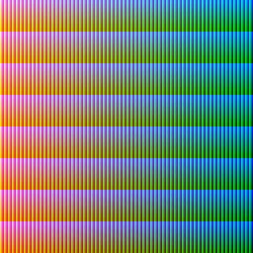
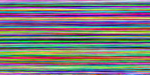

# RGB-Scramble

This is an ongoing project to recreate the work found at [All RGB colors in one image](http://joco.name/2014/03/02/all-rgb-colors-in-one-image/) in Python. This creates images that have a different color for every pixel.

Browse the tags to checkout the different iterations of the project.

## Versions

* V00 - Hello RGB

* V01 - Ordered by color similiarity using a selection sort-esque algorithm

* v02 - Find the next color by getting the first one under a threshold instead of finding the closest. 5x faster!

